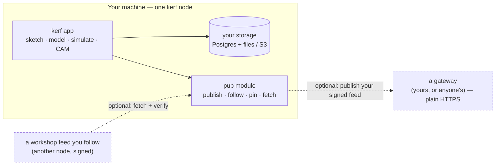

<div align="center">


# Kerf

**A complete, free, open-source CAD that runs entirely on your machine.**

Parametric sketching &amp; modeling · drawings · FEM/CFD · CAM · electronics · slicing · rendering — across 37 engineering domains, with an LLM that edits the underlying source for you. Browse and publish parts on a **distributed Workshop** with no accounts and no central server.

<sub> Part of <strong><a href="https://vulos.org">VulOS</a></strong> — the open, self-hostable web OS &amp; app suite. Runs standalone, or as an app hosted by the Vulos OS.</sub>

[](LICENSE)
[](pyproject.toml)
[](package.json)
[](#contributing)

[Website](https://kerf.sh) · [Docs](https://kerf.sh/docs) · [Roadmap](./ROADMAP.md) · [Contributing](#contributing)

<!-- Hero screenshot pending — drop the real capture at docs/screenshots/hero.png; this reference resolves once it lands. -->


</div>

---

## What is Kerf?

Kerf is a complete CAD system — sketcher, B-rep modeling kernel, drawings, assemblies, FEM/CFD, CAM, electronics/PCB, BIM, and manufacturing prep across 37 engineering domains — that installs and runs entirely on your own machine, MIT-licensed, with no account required. Every design lives in plain files (JSCAD, `.feature` JSON, `.circuit.tsx`, `.sketch`, `.drawing`) so an LLM chat panel can read, diff, and edit your project directly instead of guessing at pixels. When you want to share a part, publish it to the **Workshop** — a distributed catalog of parts built on the open **DMTAP-PUB** protocol: signed, content-addressed, no accounts, no central server, and still browsable offline once pinned.

## Features

- **Two real kernels** — JSCAD for fast iteration; OpenCascade B-rep (`.feature` files) for fillets, shells, and lossless STEP export. Pick per file.
- **2D parametric sketcher** — planegcs (FreeCAD's constraint solver, compiled to WASM), BREP face/edge picking, live length/angle dimensions.
- **Feature-tree modeling** — Pad / Pocket / Revolve / Fillet / Chamfer / Shell / Hole / Patterns / Sweep / Loft / NURBS surfacing with G3 continuity.
- **Drawings** — multi-sheet, GD&T, hatching, leaders, balloons, title blocks.
- **Assemblies** — 3D mates (coincident / concentric / distance / angle / tangent), tolerance stack-up (worst-case / RSS / Monte Carlo).
- **Electronics** — tscircuit JSX → schematic + PCB + 3D board viewer, SPICE simulation, RF s-parameters, autoroute.
- **FEM + CFD** — linear/modal/nonlinear FEM, buckling, fatigue, thermal, explicit dynamics; k-ω SST CFD via OpenFOAM.
- **CAM + manufacturing** — 2.5D/3D/lathe toolpaths and G-code posts, sheet metal, mold core/cavity split, 3D-print slicing.
- **BIM** — walls, slabs, doors, windows, schedules, IFC4 round-trip.
- **37 engineering domains** in one workspace — aerospace, silicon/IC, firmware, PLC, composites, dental, optics, jewelry, marine, civil, and more. See [`/domains`](https://kerf.sh/domains) for the full list.
- **Chat-driven editing** — an LLM reads and edits your project's source files directly; every change is a diffable, reviewable commit.
- **File revisions + git** — per-file undo history, commits, branches, and GitHub sync, all stored on your own node.
- **Distributed Workshop** — publish and browse parts over DMTAP-PUB (§22/§23 of [`github.com/vul-os/dmtap`](https://github.com/vul-os/dmtap)): signed, content-addressed, no accounts, no central server. See [How it works](#how-it-works).
- **Local-first** — no telemetry, no phone-home. With nothing configured, Kerf never opens a socket.

## Screenshots

<!-- Gallery pending real captures — paths resolve once the files land in public/screenshots/. -->

<p align="center">
  
  <em>The editor — file tree, 3D viewport, and the LLM chat panel side by side.</em>
</p>

<p align="center">
  
  <em>2D parametric sketcher driving an OpenCascade B-rep feature timeline.</em>
</p>

## Quick start (standalone)

Kerf runs **by itself** — no account, no cloud, no external service required beyond a Postgres database.

### Docker (one-liner)

```sh
git clone https://github.com/kerf-sh/kerf
cd kerf
docker compose up
```

This builds the `full` persona image and starts Kerf alongside its own Postgres and Redis containers. Open <http://localhost:8080>.

### From source

```sh
git clone https://github.com/kerf-sh/kerf
cd kerf

# Install the Python workspace packages (choose your persona):
uv sync --extra mech              # uv users — resolves the workspace
./scripts/dev-install.sh mech     # pip users — editable install helper

npm install
```

You'll need Python 3.11+, Node 22+, and Postgres 14+.

> **Note:** a bare `pip install -e .[mech]` fails — the repo is a `uv` workspace, so the local `kerf-*` packages are wired up via `[tool.uv.sources]`, which only `uv` reads. Use `uv sync` or `./scripts/dev-install.sh`. The `mech`/`full` solver extras (pythonOCC, dolfinx) are conda-only; see [docs/local-install.md](./docs/local-install.md#solver-dependencies-dolfinx--pythonocc).

```sh
export DATABASE_URL=postgres://<your-pg-user>@localhost:5432/kerf?sslmode=disable
createdb kerf
npm run init       # writes kerf.toml from kerf.example.toml — add at least one LLM API key
npm run migrate    # applies every OSS migration
npm run dev        # vite :5173 + kerf-server :8080, both hot-reloading
```

Open <http://localhost:5173>. With `local_mode = true` (the default), Kerf auto-creates a singleton user and signs you in — no login screen. Full walkthrough: [docs/getting-started.md](./docs/getting-started.md).

### Minimal config

```toml
[server]
local_mode = true      # single-user, auto-login
port = 8080

[database]
url = "postgres://postgres@localhost:5432/kerf?sslmode=disable"

[storage]
backend = "filesystem"          # your project files as real files on disk
filesystem_root = "~/kerf-projects"
```

## How it works

Every Kerf install is a full node: the app, your project store, and an optional gateway for publishing to (and reading from) the Workshop. Nothing talks to the network unless you configure it.



- **One node type.** A homelab box running Kerf and a hosted always-on node run identical software — the only difference is uptime, not capability.
- **The Workshop is a set of feeds you follow**, not a server you register with. Publishing signs a `pub_announce` and appends it to your own append-only feed (DMTAP-PUB §22.4); "following" a workshop is just fetching feeds you chose. No central catalog is authoritative — any node can rebuild a browsable index from the feeds it knows about.
- **Parts stay accessible offline** once pinned: every object is content-addressed and self-verifying, so any gateway — yours, a friend's, or a public one — can serve it without being trusted.
- **Zero-socket by default.** An unconfigured Kerf install never dials out. Publishing and following are both explicit, opt-in acts.

Full spec: [docs/node-architecture.md](./docs/node-architecture.md) · [docs/distributed-workshop.md](./docs/distributed-workshop.md).

## Configuration

`kerf.toml` (search order: `--config` flag → `KERF_CONFIG` env → `./kerf.toml` → `~/.config/kerf/config.toml` → `/etc/kerf/config.toml`). A starter file is emitted by `npm run init`. Notable knobs:

| Key | Effect |
|---|---|
| `[server].local_mode = true` | Single-user mode; auto-login, skip register/login UI |
| `[server].port = 8080` | HTTP port |
| `[storage].backend = "filesystem"` | Mirror projects to `filesystem_root` for git workflows |
| `[storage].backend = "s3"` | S3 / R2 / MinIO; set credentials in `[storage.s3]` |
| `[llm.anthropic].api_key` / `[llm.openai].api_key` / etc. | Activate that LLM provider — you bring your own key |
| `[limits].file_revisions_max` | Per-file undo history cap (default 200) |

Full schema: [`kerf.example.toml`](./kerf.example.toml). Detailed reference: [docs/configuration.md](./docs/configuration.md).

## Documentation

| Document | Description |
|---|---|
| [docs/getting-started.md](./docs/getting-started.md) | Clone to running server in about five minutes |
| [docs/node-architecture.md](./docs/node-architecture.md) | Node model, the pub module, the zero-socket invariant, DMTAP-PUB pointer |
| [docs/distributed-workshop.md](./docs/distributed-workshop.md) | Publish / follow / pin, availability states, irrevocability |
| [docs/local-install.md](./docs/local-install.md) | Self-host install paths, persona bundles, Postgres setup |
| [docs/architecture.md](./docs/architecture.md) | API surface, data model, plugin system |
| [docs/sketching.md](./docs/sketching.md) | Constraints, tools, the planegcs solver |
| [docs/electronics.md](./docs/electronics.md) | tscircuit, PCB, SPICE, RF, autoroute |
| [docs/capabilities.md](./docs/capabilities.md) | Every plugin's capability tags + personas |
| [docs/llm-tools.md](./docs/llm-tools.md) | Full LLM tool catalogue (input/output schema) |
| [docs/sdk.md](./docs/sdk.md) | Scripting with the Python SDK (`kerf-sdk`, PyPI) |
| [docs/contributing.md](./docs/contributing.md) | Dev setup, migrations, PR checklist |
| [ROADMAP.md](./ROADMAP.md) | Shipped · in-flight · next · planned |

## Development

```sh
npm run dev         # vite :5173 + kerf-server :8080, hot-reload
npm run build        # production build (Vite SPA)
npm run lint         # ESLint
npm test             # vitest (frontend)
npm run test:e2e     # Playwright end-to-end

# Backend — run from repo root so the root conftest loads
PYTHONHASHSEED=0 pytest packages/ -n auto        # full suite
pytest packages/kerf-api/tests/                  # one plugin
```

See [docs/contributing.md](./docs/contributing.md) for the full dev-setup guide, and [docs/architecture.md](./docs/architecture.md) for the plugin system and monorepo layout.

## Contributing

PRs welcome. Pick anything marked `📋 next` or `🔮 planned` in [ROADMAP.md](./ROADMAP.md); for larger work, open an issue first so we can align scope.

- **Issues + discussions**: [github.com/kerf-sh/kerf/issues](https://github.com/kerf-sh/kerf/issues) · [github.com/kerf-sh/kerf/discussions](https://github.com/kerf-sh/kerf/discussions)
- **Style**: ESLint + Prettier defaults. Match the surrounding code.
- **Tests**: every PR that touches a plugin should add or extend a test in `packages/kerf-<plugin>/tests/`.
- **Commits**: imperative tense, ~70 chars.
- **The LLM edits source files directly.** If you add a new file kind or feature, also add a `packages/kerf-chat/llm_docs/<topic>.md` so the model knows about it.

See [docs/contributing.md](./docs/contributing.md) for the full checklist.

## License

[MIT](./LICENSE) — free to use, modify, and distribute.

Built in Durban by a small team. Engineered for engineers everywhere.
