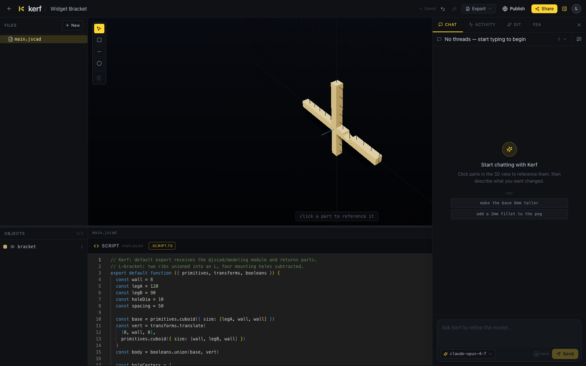
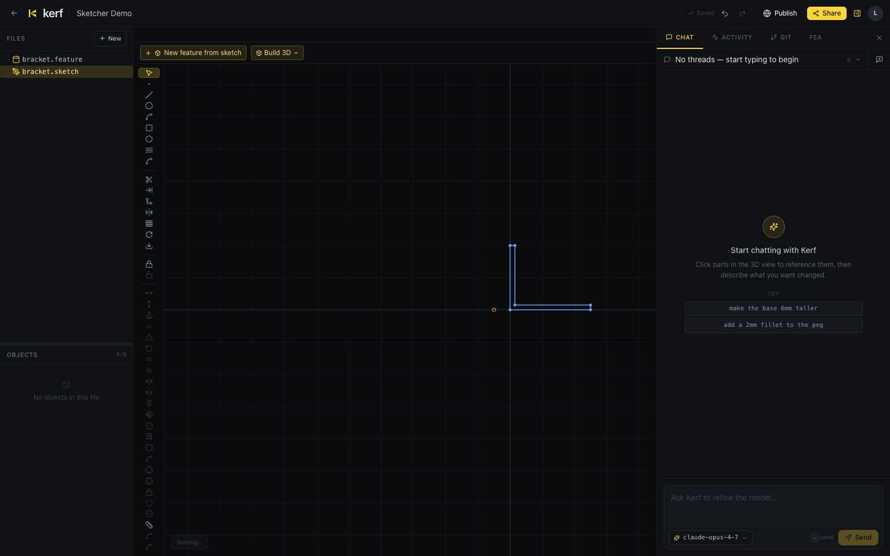
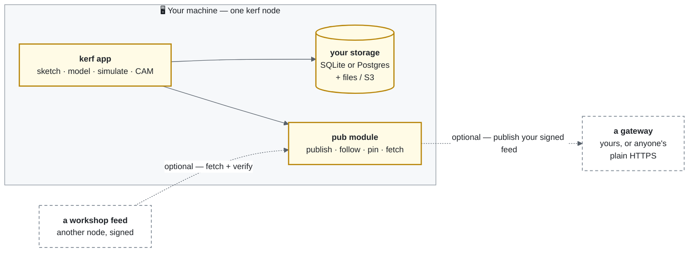

<div align="center">


# Kerf

**A complete, free, open-source CAD that runs entirely on your machine.**

Parametric sketching &amp; modeling across five geometry kernels · drawings · FEM/CFD · CAM · electronics · slicing · rendering — across 37 engineering domains, with an LLM that edits the underlying source for you. Browse and publish parts on a **distributed Workshop** with no accounts and no central server.

<a href="https://vulos.org" title="Vulos — open, self-hostable software"></a>

[](LICENSE)
[](https://github.com/vul-os/kerf/releases/latest)
[](pyproject.toml)
[](package.json)
[](#development)
[](#contributing)

[Website](https://vulos.org/projects/kerf/) · [Docs](https://vulos.org/projects/kerf/docs.html) · [Feature parity](https://vulos.org/projects/kerf/parity.html) · [Releases](https://github.com/vul-os/kerf/releases) · [Roadmap](./ROADMAP.md) · [Contributing](#contributing)



</div>

---

## What is Kerf?

Kerf is a complete CAD system — sketcher, five geometry kernels, drawings, assemblies, FEM/CFD, CAM, electronics/PCB, BIM, and manufacturing prep across 37 engineering domains — that installs and runs entirely on your own machine, MIT-licensed, with no account required. Every design lives in plain files (JSCAD, `.feature` JSON, `.circuit.tsx`, `.sketch`, `.drawing`) so an LLM chat panel can read, diff, and edit your project directly instead of guessing at pixels. When you want to share a part, publish it to the **Workshop** — a distributed catalog of parts built on the open **DMTAP-PUB** protocol: signed, content-addressed, no accounts, no central server. Publish, follow, verify, and pin are built and tested against the shared DMTAP conformance vectors; the Workshop itself ships as an opt-in extra (`pip install 'kerf[server,pub]'`), and *browsing* is not yet offline — a pinned part's bytes are local and readable with the network down, but the browse index is rebuilt from live feeds on each visit, so a followed publisher's feed has to be reachable to list it. See [the Workshop's current limits](#the-workshops-current-limits).

## Features

### Kernels &amp; geometry

Most CAD tools give you one kernel. Kerf gives you five, picked per file and mixed in one assembly:

| Kernel | What it's for |
|---|---|
| **JSCAD (CSG)** | Fast boolean iteration, programmatic parts |
| **OpenCascade B-rep** (`.feature` JSON, via `pythonocc-core`) | Fillets, shells, lossless STEP/IGES export |
| **Analytic NURBS** | Curve/surface fit, boolean, G0–G3 continuity checking + curvature-comb visualization for Class-A surfacing |
| **Catmull-Clark SubD** | Stam-limit evaluation, creases, quad-cage editing for organic forms |
| **SDF / F-rep** | Smooth-min CSG, Lorensen–Cline marching cubes, TPMS lattices for generative geometry |

Plus: a 2D parametric sketcher (planegcs — FreeCAD's constraint solver, compiled to WASM), a full feature tree (Pad / Pocket / Revolve / Fillet / Chamfer / Shell / Hole / Patterns / Sweep / Loft), multi-sheet drawings with GD&amp;T, and 3D assembly mates with tolerance stack-up (worst-case / RSS / Monte Carlo).

### Simulation

In-house solvers where it counts, and honest bridges to production tools where that's the right call:

- **FEM** — linear/modal/nonlinear/buckling/fatigue/thermal/explicit dynamics, contact, and plasticity (J2, Drucker–Prager, Hill) run in-house. An optional [CalculiX bridge](./docs/fem-calculix-bridge.md) generates production-grade 3D solid FEA decks (tet/hex elements) and parses results back.
- **CFD** — in-house RANS (k-ε, k-ω SST), compressible, VOF, and combustion solvers. An optional [OpenFOAM bridge](./docs/cfd-openfoam.md) generates complete, runnable case directories (simpleFoam / buoyantSimpleFoam / interFoam).
- **Topology optimization** — SIMP via a FEniCSx bridge.
- **Motion** — in-house multibody dynamics: joints, forces, inverse kinematics and dynamics.
- **Optics** — in-house paraxial ABCD lens design + physical-optics propagation.
- **1D systems** — in-house Modelica-class DAE solver and component library.

### Electronics

tscircuit JSX → schematic + PCB + 3D board viewer. SPICE simulation via a native `ngspice` subprocess, RF s-parameters, autoroute via a FreeRouting bridge, plus signal/power integrity (EMC, SI, PDN) and multi-board harness tools.

### Manufacturing

2.5D/3D/lathe/wire-EDM CAM toolpaths with Fanuc G-code posts, sheet metal, mold core/cavity splitting, nesting, GD&amp;T (ASME Y14.5) callouts, and 3D-print slicing via a CuraEngine bridge.

### BIM &amp; AEC

Walls, slabs, doors, windows, MEP families, schedules, and IFC round-trip; civil alignment/corridor/earthwork; structural RC/steel + rebar design; HVAC duct fabrication; material quantity takeoff and cost rollup.

### Domains

**37 engineering domains** — jewelry, mechanical, electronics, architecture, automotive, civil, composites, dental, optics, horology, piping, packaging, mold, woodworking, marine, silicon, firmware, aerospace, PLC, motion, FEM/CFD, textiles, and more — the most-used ones each with a dedicated workspace at [`/domains`](https://vulos.org/projects/kerf/#domains). Under the hood, 50+ Python plugins reach further still: apparel, energy, entertainment, LCA, microfluidics, PLM, wiring, landscape, HVAC, and more.

Measured against the industry, not just described: a public [feature-comparison matrix](https://vulos.org/projects/kerf/compare) tracks 1,397 features across 57 CAD/BIM/EDA packages — SolidWorks, Revit, Altium, KiCad, Rhino, and more.

### Chat-driven editing

An LLM reads and edits your project's source files directly — through a registry of 3,000+ purpose-built tools spanning every plugin. It searches an embedded docs corpus before acting, then edits like a fast, literal collaborator. Every change is a diffable, reviewable commit.

### Distributed Workshop

Publish and browse parts over DMTAP-PUB (§22/§23 of [`github.com/vul-os/dmtap`](https://github.com/vul-os/dmtap)): signed, content-addressed, no accounts, no central server. Opt-in — `pip install 'kerf[server,pub]'`; `kerf[server]` alone has no `/api/pub/*`. See [How it works](#how-it-works) and [its current limits](#the-workshops-current-limits).

### Your data

File revisions (per-file undo history) + local git (commits, branches, GitHub sync), all stored on your own node. MIT licensed. No telemetry, no phone-home — with nothing configured, Kerf never opens a socket.

## Screenshots

<p align="center">
  
  <em>The 2D parametric sketcher — constrained geometry that feeds the OpenCascade B-rep feature tree via "New feature from sketch".</em>
</p>


## Quick start (standalone)

Kerf runs **by itself** — no account, no cloud, no external service, and no database server. State lives in an embedded SQLite file at `~/.kerf/kerf.db`. Postgres is a one-line opt-in for shared installs.

### Install

Download the build for your platform from the [latest release](https://github.com/vul-os/kerf/releases/latest):

| Platform | Asset |
|---|---|
| macOS (Apple Silicon) | `kerf-vX.Y.Z-macos-arm64.tar.gz` |
| macOS (Intel) | `kerf-vX.Y.Z-macos-x64.tar.gz` |
| Linux (x64) | `kerf-vX.Y.Z-linux-x64.tar.gz` |
| Source | `kerf-vX.Y.Z-src.tar.gz` |

Unpack it and run `./install.sh` from inside the tarball — it sets up a Python venv with everything installed. No Docker, no `git clone`.

Every release ships a `SHA256SUMS` manifest covering all assets plus a sigstore build-provenance attestation. To verify before running:

```sh
bash verify.sh --tag vX.Y.Z --attest kerf-vX.Y.Z-linux-x64.tar.gz
```

See [docs/releasing.md](./docs/releasing.md) for the full artifact matrix.

### Docker

```sh
git clone https://github.com/vul-os/kerf
cd kerf
docker compose up
```

This builds the `full` persona image and starts Kerf against its own embedded SQLite database — no Postgres or Redis containers required. Open <http://localhost:8080>.

### From source

```sh
git clone https://github.com/vul-os/kerf
cd kerf

# Install the Python workspace packages (choose your persona):
./scripts/dev-install.sh mech     # editable install helper — works with plain pip

npm install
```

You'll need Python 3.11+ and Node 22+. No database server — Kerf creates its own SQLite file on first run.

> **Note:** a bare `pip install -e .[mech]` fails — the repo is a `uv` workspace, so the local `kerf-*` packages are wired up via `[tool.uv.sources]`, which only `uv` reads. `./scripts/dev-install.sh` works around that by installing every persona package editable in one `pip install` call.
>
> **`uv sync` currently doesn't work for *any* persona** (not just `mech`/`full`) — `kerf-cad-core`, `kerf-cam`, `kerf-fem`, and `kerf-topo` each declare a conda-forge-only extra (pythonOCC, FEniCSx/dolfinx), and uv resolves one lockfile for the whole workspace, so it always tries to satisfy those extras regardless of which `--extra` you pass. Even `uv sync --extra api-only` or a bare `uv sync` fails with "No solution found ... requirements are unsatisfiable." Use `./scripts/dev-install.sh` until that's untangled. Either way, the `mech`/`full` solver stack (pythonOCC, dolfinx) is conda-only; see [docs/local-install.md](./docs/local-install.md#solver-dependencies-dolfinx--pythonocc).

```sh
npm run init       # writes kerf.toml from kerf.example.toml — add at least one LLM API key
npm run migrate    # applies every migration against ~/.kerf/kerf.db
npm run dev        # vite :5173 + kerf-server :8080, both hot-reloading
```

<details>
<summary>Using Postgres instead (shared or multi-user installs)</summary>

Set `DATABASE_URL` before migrating and Kerf uses Postgres instead — nothing else changes.

```sh
createdb kerf
export DATABASE_URL=postgres://<your-pg-user>@localhost:5432/kerf?sslmode=disable
npm run migrate
```

The same value can live in `kerf.toml` under `[database] url`. Both the plain
`DATABASE_URL` and the `KERF_DATABASE_URL` form are read.

</details>

Open <http://localhost:5173>. With `local_mode = true` (the default), Kerf auto-creates a singleton user and signs you in — no login screen. Full walkthrough: [docs/getting-started.md](./docs/getting-started.md).

### Minimal config

```toml
[server]
local_mode = true      # single-user, auto-login
port = 8080

[database]
# Omit entirely for the default: embedded SQLite at ~/.kerf/kerf.db.
# Set it only if you want Postgres:
# url = "postgres://postgres@localhost:5432/kerf?sslmode=disable"

[storage]
backend = "filesystem"          # your project files as real files on disk
filesystem_root = "~/kerf-projects"
```

## How it works

Every Kerf install is a full node: the app, your project store, and an optional gateway for publishing to (and reading from) the Workshop. Nothing talks to the network unless you configure it.


```mermaid
%%{init: {'theme':'base','themeVariables':{
  'fontFamily':'ui-monospace, SFMono-Regular, Menlo, monospace',
  'fontSize':'14px',
  'primaryColor':'#fffbe6',
  'primaryTextColor':'#1f2328',
  'primaryBorderColor':'#b8860b',
  'lineColor':'#57606a',
  'tertiaryColor':'#f6f8fa',
  'tertiaryTextColor':'#1f2328',
  'tertiaryBorderColor':'#57606a',
  'clusterBkg':'#f6f8fa',
  'clusterBorder':'#8c959f',
  'edgeLabelBackground':'#ffffff'
}}}%%
flowchart LR
  subgraph Node["🖥️  Your machine — one kerf node"]
    direction TB
    App["<b>kerf app</b><br/>sketch · model · simulate · CAM"]
    Store[("<b>your storage</b><br/>SQLite or Postgres<br/>+ files / S3")]
    Pub["<b>pub module</b><br/>publish · follow · pin · fetch"]
    App --> Store
    App --> Pub
  end

  GW["<b>a gateway</b><br/>yours, or anyone's<br/>plain HTTPS"]
  Feed["<b>a workshop feed</b><br/>another node, signed"]

  Pub -. "optional — publish your signed feed" .-> GW
  Feed -. "optional — fetch + verify" .-> Pub

  classDef core fill:#fffbe6,stroke:#b8860b,stroke-width:2px,color:#1f2328;
  classDef outside fill:#ffffff,stroke:#8c959f,stroke-width:1.5px,stroke-dasharray:5 4,color:#1f2328;
  class App,Store,Pub core;
  class GW,Feed outside;
```

- **One node type.** A homelab box running Kerf and a hosted always-on node run identical software — the only difference is uptime, not capability.
- **The Workshop is a set of feeds you follow**, not a server you register with. Publishing signs a `pub_announce` and appends it to your own append-only feed (DMTAP-PUB §22.4); "following" a workshop is just fetching feeds you chose. No central catalog is authoritative — any node can rebuild a browsable index from the feeds it knows about.
- **A pinned part's bytes stay readable offline**: pinning hydrates every manifest and chunk into your own store, and every object is content-addressed and self-verifying, so any gateway — yours, a friend's, or a public one — can serve it without being trusted.
- **Zero-socket by default.** An unconfigured Kerf install never dials out. Publishing and following are both explicit, opt-in acts.

### The Workshop's current limits

Honest scope, measured against the code rather than the design:

| | Status |
|---|---|
| Publish (manifest + signed `pub_announce` + append to your own feed) | Built |
| Follow / unfollow, verified feed resolve with the §22.4.2 anti-rollback and fork checks | Built |
| Client-side verification of every object (re-addressed, signature re-checked) | Built — §22 conformance vectors replayed in `packages/kerf-pub/tests/` |
| Pin + hydrate (fetch and self-verify every chunk; partial hydration never reads as `on-node`) | Built |
| Assembly BOM DAG walk, cycle refusal | Built |
| **Offline *browsing*** | **Not built.** `PubClient.resolve()` does not persist a followed feed's head or entries — only your own feed is written locally (`_append_own_feed`) — so `GET /api/pub/workshop` lists nothing for a followed publisher whose PUB server is unreachable, even when its parts are pinned. The pinned bytes are still fetchable; the catalog view is not. |
| Wake (optional push "new revision" pings) | **Partly built, and one-ended.** *Receiver:* `public/sw.js` enforces all three of the substrate's §8.4 device-side gates fail-closed before it does any work — content-free shape check (`0x0313`), bounded persisted replay-nonce cache (`0x0316`), and an inbound rate-limit backstop holding DMTAP §16's budget of ≤ 1 wake / 60 s, ≈ 30 / h (`0x0315`). *Emitter:* **no** rate limit and no burst coalescing (one push per subscriber per publish), so §8.4's "rate-limited at both ends" is only half met. Kerf's topology also does not inherit §8.2's social-graph privacy — the push relay sees a follow edge, not a self-edge. Off entirely unless the node operator sets VAPID keys. |
| Ships by default | **No.** The Workshop is the `pub` extra: `pip install 'kerf[server,pub]'`. `kerf[server]` deliberately excludes DMTAP-PUB. |
| `submit` (DMTAP-PUB compute) | Not built — out of scope for v1, raises `NotImplementedError`. |

Full spec: [docs/node-architecture.md](./docs/node-architecture.md) · [docs/distributed-workshop.md](./docs/distributed-workshop.md).

## Configuration

`kerf.toml` (search order: `--config` flag → `KERF_CONFIG` env → `./kerf.toml` → `~/.config/kerf/config.toml` → `/etc/kerf/config.toml`). A starter file is emitted by `npm run init`. Notable knobs:

| Key | Effect |
|---|---|
| `[server].local_mode = true` | Single-user mode; auto-login, skip register/login UI |
| `[server].port = 8080` | HTTP port |
| `[storage].backend = "filesystem"` | Mirror projects to `filesystem_root` for git workflows |
| `[storage].backend = "s3"` | S3 / R2 / MinIO; set credentials in `[storage.s3]` |
| `[llm.anthropic].api_key` / `[llm.openai].api_key` / etc. | Activate that LLM provider — you bring your own key |
| `[limits].file_revisions_max` | Per-file undo history cap (default 200) |

Full schema: [`kerf.example.toml`](./kerf.example.toml). Detailed reference: [docs/configuration.md](./docs/configuration.md).

## Documentation

| Document | Description |
|---|---|
| [docs/getting-started.md](./docs/getting-started.md) | Clone to running server in about five minutes |
| [docs/node-architecture.md](./docs/node-architecture.md) | Node model, the pub module, the zero-socket invariant, DMTAP-PUB pointer |
| [docs/distributed-workshop.md](./docs/distributed-workshop.md) | Publish / follow / pin, availability states, irrevocability |
| [docs/local-install.md](./docs/local-install.md) | Self-host install paths, persona bundles, optional Postgres |
| [docs/architecture.md](./docs/architecture.md) | API surface, data model, plugin system |
| [docs/sketching.md](./docs/sketching.md) | Constraints, tools, the planegcs solver |
| [docs/electronics.md](./docs/electronics.md) | tscircuit, PCB, SPICE, RF, autoroute |
| [docs/capabilities.md](./docs/capabilities.md) | Every plugin's capability tags + personas |
| [docs/llm-tools.md](./docs/llm-tools.md) | Full LLM tool catalogue (input/output schema) |
| [docs/sdk.md](./docs/sdk.md) | Scripting with the Python SDK (`kerf-sdk`, PyPI) |
| [docs/contributing.md](./docs/contributing.md) | Dev setup, migrations, PR checklist |
| [ROADMAP.md](./ROADMAP.md) | Shipped · in-flight · next · planned |

## Development

```sh
npm run dev         # vite :5173 + kerf-server :8080, hot-reload
npm run build        # production build (Vite SPA)
npm run lint         # ESLint
npm test             # vitest (frontend)
npm run test:e2e     # Playwright end-to-end (run `npm run build` first — it serves web/dist)

# Backend — run from repo root so the root conftest loads
make test                                        # default tier — expected GREEN (~3 min)
pytest packages/kerf-api/tests/                  # one plugin
make test-kernel                                 # kerf-cad-core geometry kernel (~75 min)
make test-domains                                # the engineering-domain plugins — experimental, currently RED
```

`make test` (equivalently a bare `pytest`) runs the load-bearing packages and
is the tier CI gates on — if it is red, that is a regression. The kernel and
domain tiers have known failures and are **not** a gate. See
[docs/TESTING.md](./docs/TESTING.md) for what each tier covers, the measured
per-package numbers, and the known root causes.

See [docs/contributing.md](./docs/contributing.md) for the full dev-setup guide, and [docs/architecture.md](./docs/architecture.md) for the plugin system and monorepo layout.

## Contributing

PRs welcome. Pick anything marked `📋 next` or `🔮 planned` in [ROADMAP.md](./ROADMAP.md); for larger work, open an issue first so we can align scope.

- **Issues + discussions**: [github.com/vul-os/kerf/issues](https://github.com/vul-os/kerf/issues) · [github.com/vul-os/kerf/discussions](https://github.com/vul-os/kerf/discussions)
- **Style**: ESLint + Prettier defaults. Match the surrounding code.
- **Tests**: every PR that touches a plugin should add or extend a test in `packages/kerf-<plugin>/tests/`.
- **Commits**: imperative tense, ~70 chars.
- **The LLM edits source files directly.** If you add a new file kind or feature, also add a `packages/kerf-chat/llm_docs/<topic>.md` so the model knows about it.

See [docs/contributing.md](./docs/contributing.md) for the full checklist.

## Brand

The mark in [`brand/`](brand/) is the source of truth. Every icon this repo
ships — favicon, PWA and app icons, the mark in the README and on the site — is
rendered from `brand/logo.svg` rather than redrawn, so there is one approved
drawing and no second copy to drift.

Copy it outward, never edit a derived copy, and never edit `brand/` to match
something downstream.

## License

Kerf's own source is **[MIT](./LICENSE)** — free to use, modify and distribute, with no
excluded paths and no proprietary tier.

The application it builds links libraries under other licences: the OpenCascade B-rep kernel
(`opencascade.js`, LGPL-2.1), STEP/IGES import (`occt-import-js`, LGPL-2.1), the sketch solver
(`planegcs`, LGPL-2.0+) and IFC read/write (`web-ifc`, MPL-2.0). All permit use from MIT code —
which is why they were chosen where GPL alternatives were not — but if you redistribute a build,
[THIRD-PARTY-LICENSES.md](./THIRD-PARTY-LICENSES.md) lists what you need to carry with it.

---

<div align="center">

<a href="https://vulos.org" title="Vulos — open by design"></a>

**[Vulos](https://vulos.org)** — open by design

</div>
